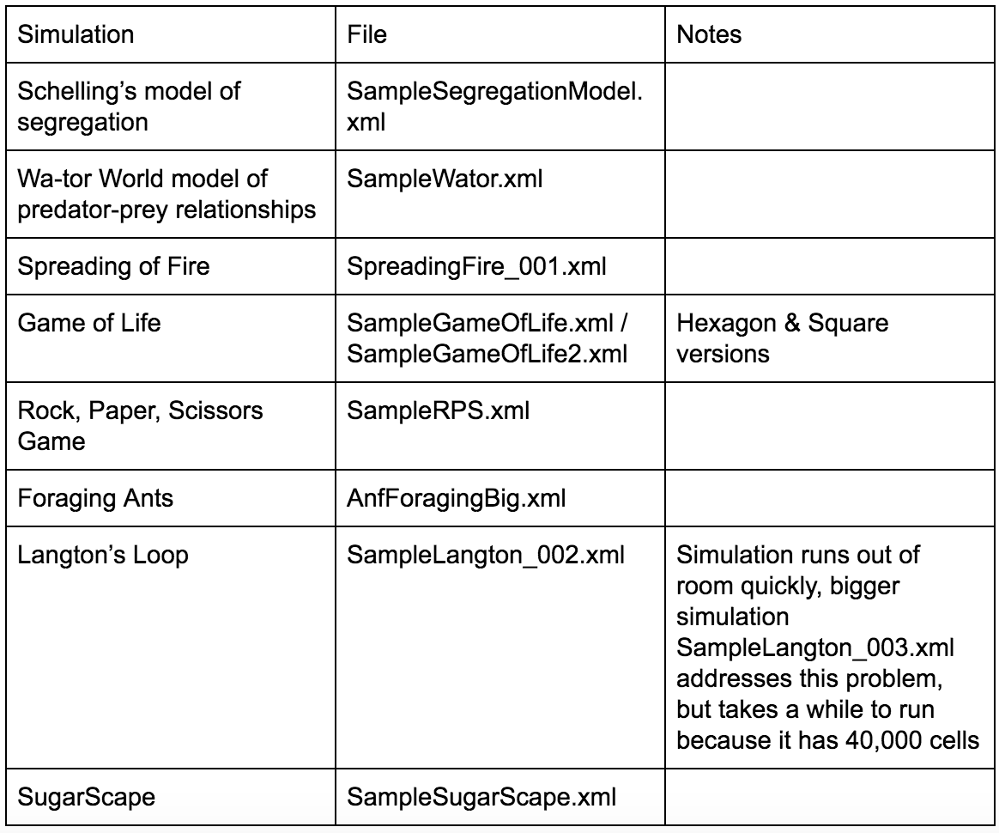

# CellSociety_Team11 

### Information
Names: Miles Todzo, Belanie Nagiel, Kelley Scroggs

Date Started: 1/29/18
Date Ended: 2/11/18

Cumulative Hours Worked: 120

### Roles
Miles: 

Belanie: 
* Setup class
* DisplayGrid class
* PopulationGraph class
* XMLCreation class
* Buttons superclass, PauseButton, StartButton, and StopButton subclasses
* some work on creating XML files by hand

Kelley:
* CellOccupant superclass, FireOccupant, LangtonOccupant, RPSOcccupant, WatorOccupant subclasses
* Work on grids such as specific neighbors
* LoadGridException class
* Exceptions and Error handling
Put your source code, resources, and property files here.

### Resources
1. [UI Controls](https://docs.oracle.com/javase/8/javafx/user-interface-tutorial/ui_controls.htm)
2. [Reading XML Files](https://www.mkyong.com/java/how-to-read-xml-file-in-java-dom-parser/)
3. [Reading .properties Files](https://www.mkyong.com/java/java-properties-file-examples/)
4. [BorderPane](https://docs.oracle.com/javase/8/javafx/api/javafx/scene/layout/BorderPane.html)
5. [VBox](https://docs.oracle.com/javafx/2/api/javafx/scene/layout/VBox.html)
6. [GridPane](https://docs.oracle.com/javafx/2/api/javafx/scene/layout/GridPane.html)
7. [FileChooser](https://stackoverflow.com/questions/5721504/jfilechooser-set-directory-to-a-path-in-a-file)
8. [Creating XML Files](https://stackoverflow.com/questions/23520208/how-to-create-xml-file-with-specific-structure-in-java)
9. [Opening Multiple Windows](https://stackoverflow.com/questions/26674498/how-to-open-two-javafx-windows)
10. [Array of Lists](https://stackoverflow.com/questions/8559092/create-an-array-of-arraylists)
11. [LinceChart](http://tutorials.jenkov.com/javafx/linechart.html)
12. [Creating Hexagons](https://www.redblobgames.com/grids/hexagons/)
13. [Using Polygon](https://www.tutorialspoint.com/javafx/2dshapes_polygon.htm)
14. [Langton Loops](http://diga.me.uk/LangtonLoops.html)
15. [More Langton Loops](http://lslwww.epfl.ch/pages/embryonics/thesis/Chapter3.html)

### File to Start
Setup.java

### Using the Program
The following table matches simulation to their input files:

The following table lays out the sample buggy input files we created:

Other errors we handle without crashing:
* any type of invalid input from user while creating either random or probability specific XML files for simulations

### Resource Files

 
 
### Decisions, Assumption, Simplifications
* Some simulation specific parameters (probability of a state catching fire when neighbor is on fire) are stated in the CellOccupant subclass for the simulation type. In order for the user to change them, the variable must be changed in these classes, but this only needs to be done once.
* When a  user opens up a new simulation in a new window, the two simulations will be running separately and they do not need to be the same type of simulation or the same simulation.
* A user can specify whether they want hexagonal or square cells in the XML file.
* A 