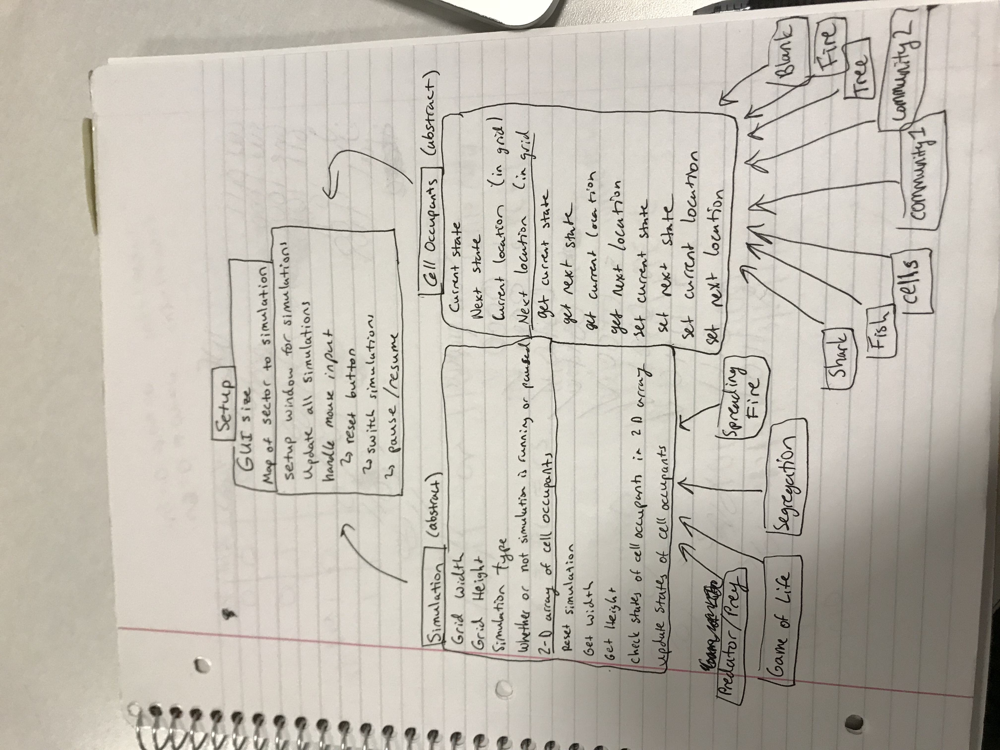

### Introduction

We are trying to write a program that animates a 2D grid CA simulation. We want to be able to model a variety of cellular automaton (CA) replication and destruction scenarios, i.e. game of life and spreading fire. The program should be flexible enough to adapt to different styles of simulation, different original configuration, and different configuration update rules. Our primary design goals are to make the program easily adaptable so that new simulations and rules can be configured quickly and easily. Initially, we want our program to handle the four base simulations and make it easy for the user to input new configurations. Some open aspects of our primary architecture will be setting simulation parameters and switching simulations. Some closed aspects of our primary architecture will be applying rules to movement of cells, to updating the states of specific cell occupants, and to moving a simulation to the next generation. Later on, we would hope to extend our flexibility to include a variety of simulation types and other forms of user input. We also hope to use inheritance to improve the quality of our code with DIY and DRY design concepts.

### Overview

We are planning on having one class, two superclasses, and 12 subclasses. The Setup class will deal with the GUI and will handle user input. The Simulation superclass will be an abstract class that will provide methods for checking and updating the status of cell occupants as well as getters and setters for the size of the simulation. The subclasses of Simulation will be GameOfLife, Segregation, PredatorPrey, and SpreadingFire. The CellOccupant superclass will be an abstract class that will provide methods for getting and setting current state, next state, current location, and next location for various cell occupants. The subclasses of CellOccupant will be Shark, Fish, Cells, Community1, Community2, Tree, Fire, and Blank. These subclasses may have additional instance variables or methods that are tailored specifically to their simulation which we will address as needed.

Each simulation has specified CellOccupant objects and a Simulation object that will provide the proper rules for updating cells. 

### User Interface

change: which simulation, pause/resume, reset/start
This section describes how the user will interact with your program (keep it very simple to start). It should describe the overall appearance of program's user interface components and how users interact with these components (especially those specific to your program, i.e., means of input other than menus or toolbars). It should also include one or more pictures of the user interface (these pictures can be hand drawn and scanned in, created with a standard drawing program, or screen shots from a dummy program that serves as a exemplar). Finally, it should describe any erroneous situations that are reported to the user (i.e., bad input data, empty data, etc.). This section should go into as much detail as necessary to cover all your team wants to say.

### Design Details

The Setup class will read in the fill and parse out the configuration parameters and then will instantiate all of the simulations. Additionally, it will create the GUI window and will update the window as time passes. The Setup class will also handle the mouse input for the reset/start, pause/resume, and switch simulation buttons. Ultimately, the Setup class will create a map of grid sectors to Simulation objects. 

The subclasses of Simulation will take in configuration parameters such as grid width and height, simulation type, and a 2D array of CellOccupant objects. It will also have a boolean instance variable that will indicate whether or not the simulation is running. Within this class there will be a checkStates method that will search through the array and assign values to the nextState and nextLocation of each CellOccupant based on the neighbors of the occupant, a updateStates method that will update the 2D array of CellOccupants based on the nextState and nextLocation values of the occupant, a resetSimulation method that will return the simulation to its original configuration read from the XML file, and getters and setters for Width and Height.

The subclasses of CellOccupant will take in configuration parameters such as currentState, nextState, currentLocation, and nextLocation. The methods in this class will be getters and setters for the previous parameters. Specific CellOccupants may have added instance variable such as probCatch for Tree, however, we will update these as needed based on the specifications of the XML files. 

Use Cases:
* Middle Cell: In the checkStates method within the GameOfLife subclass, we will iterate through each index of the 2D array and will check the available neighbors to decide on a next state for the cell using the XML specifications.
* Edge Cell: In the checkStates method within the GameOfLife subclass, we will iterate through each index of the 2D array and will check the available neighbors to decide on a next state for the cell using the XML specifications. We will make sure to check the location of the current cell in order to avoid IndexOutOfBounds exceptions.
* Next Generation: The Setup class will contain an update method that will serve as a sort of game loop and will display the result of the cells at the next time frame. The updateStates method within GameOfLife will dictate the locations and states of the cells being displayed. 
* Simulation Parameter: The Setup class will read through the XML file and will pass the proper instance variables to the SpreadingFire simulation. This probCatch variable will later be used in the checkStates method within the SpreadingFire class in order to determine the next state of a Tree cell that is next to a Fire cell.
* Switch Simulation: The Setup class will handle mouse input and upon the user pressing the Go button, it will check if a valid sector number and simulation type were entered in the adjacent text boxes. Then, simulation sectors will either be added or updated. 

### Design Considerations

### Team Responsibilities